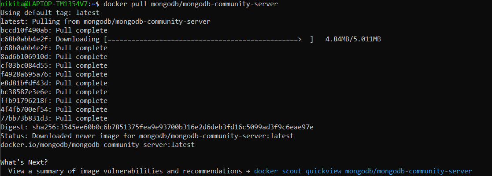
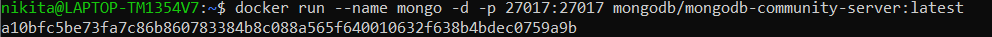
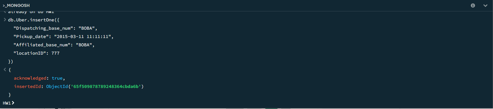
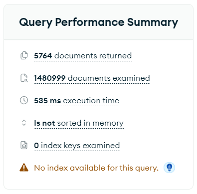
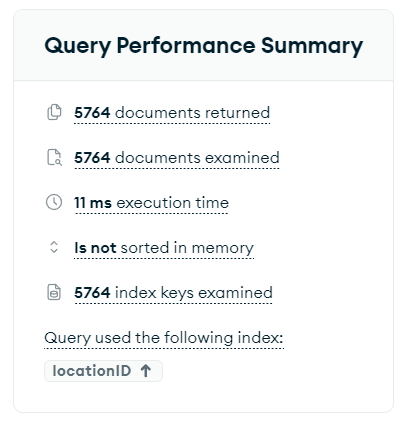
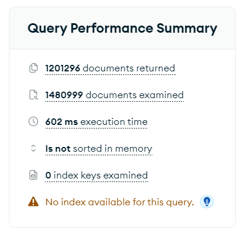
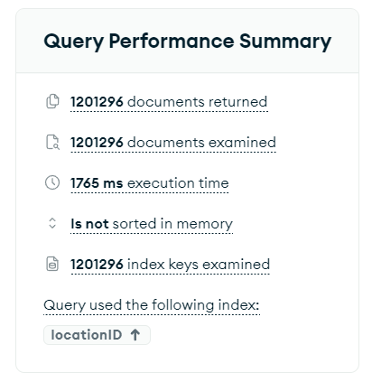

## Отчет по MongoDB

1. Запускаем докер

2. Скачиваем и запускаем mongo по инструкции с официального сайта, добавив флаг -p 27017:27017, без него не работает из коробки

3. Скачиваем Compass, подключаемся к localhost:27017

4. Скачал данные отсюда: https://www.kaggle.com/datasets/fivethirtyeight/uber-pickups-in-new-york-city

5. В БД загрузил данные за 2015 год. Весит файл примерно 500 МБ и содержит 1.5 миллиона записей. Хоть и в каждой записи информации немного, но в mongo он загружался где-то полтора часа.

6. Выполним пару простых запросов

    Добавим новое значение

    

    Найдем его

    

    Изменим

    

    Ну и, наконец, удалим

    
    
7. Теперь сравним скорость выполнения запросов выборки с индексом и без. Для этого выполним два запроса на выборку по полю locationID. В первом запросе результат выборки будет относительно небольшой, а второй должен покрыть большую часть данных. Затем добавим индекс на это поле и повторим запросы.

    Выполним запрос с небольшим выходом

    

    Результат без индекса

    

    Результат с индексом

    

    Теперь рассмотрим запрос с большим выборкой

    

    Результат без индекса

    

    Результат с индексом

    

    Видим, что на маленькой выборке индекс дает огромный прирост скорости выполнения запроса, а на большой, наоборот, значительно ухудшает.

**Вывод:** в ходе лабороторной работы протестировали СУБД MongoDB, выполнили простые CRUD запросы и сравнили производительность запросов выборки с индексом и без.

Mongo показалась мне очень простой и легкой в использовании. Понравилась работа с Compass. Язык запросов достаточно понятен, но в некоторых моментах не очень интуитивен и, на мой вгляд, иногда уступает SQL с этой точки зрения. Объем данных был немаленьким, но его загрузка в БД длилась дольше, чем я ожидал.

Индексное сканирование стоит использовать, когда предполагается, что результат запроса будет небольшим. Тогда скорость выполнения сильно увеличиваетя. В противном случае скорость падает.