# Отчет по Redis
## Установка и базовые команды

Для начала запустим Redis в контейнере командой

`docker run -d --name redis-stack -p 6379:6379 -p 8001:8001 redis/redis-stack:latest`


Откроем RedisInsight и добавим в БД подготовленный json файл, который весит 60МБ. (Он был получен конвертированием большого csv файла с помощью pandas)


Посмотрим на время выполнения операции:


Чуть больше секунды - приемлемо.

Теперь, используя python, загрузим этот файл в БД в разных форматах и замерим производительность. Код лежит в папке code в файле req.py

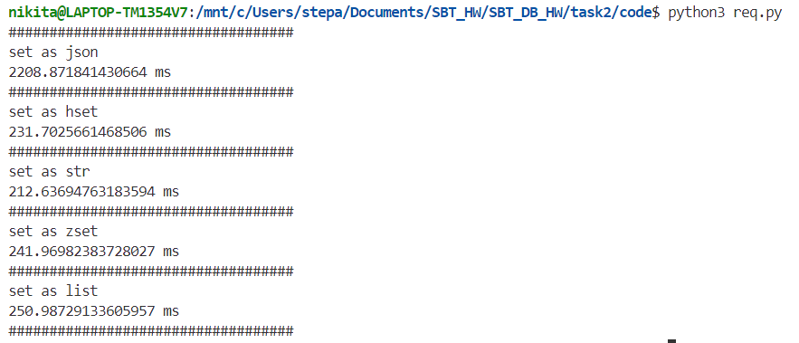


Видим, что формат данных json неоптимальный. Он занимает в 3 раза больше места, соответственно и загружается дольше. При этом через python он грузится в 2 раза медленнее.

Посмотрим на скорость чтения:

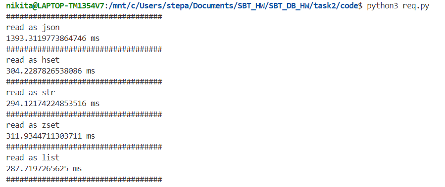

Схожие времена. json снова работает не очень.

Можем вычислить пропускную способность: 240 МБ/с.


Теперь протестируем пропускную способность с помощью утилиты redis-benchmark:

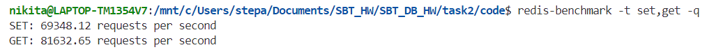

Получаем, исходя из того, что по умолчанию в одном запросе информации 3 байта информации, 225 КБ/с.

Теперь в одном запросе будет килобайт информации:

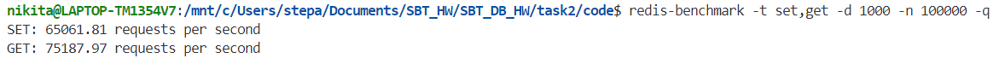

Получаем 70 МБ/с, уже лучше.

Ну и теперь в одном запросе 1МБ информации.

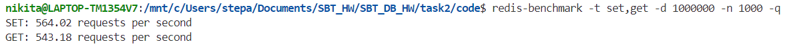

Получили 550 МБ/с. Совсем неплохо!

### Кластер

Создадим кластер из 3х мастер узлов, и 3х реплик узлов, то есть по одной реплике каждого мастер узла. Для этого используем 6 серверов.

На каждом сервере запускаем redis со следующим конфигурационным файлом:
```
port 6379
cluster-enabled yes
cluster-config-file nodes.conf
cluster-node-timeout 2000
appendonly yes
requirepass pass
masterauth pass
```

Затем на одном из серверов выполняем команду

`redis-cli --cluster create 92.63.192.58:6379 82.146.58.207:6379 86.110.194.105:6379 188.120.225.127:6379 188.120.231.194:6379 188.120.234.173:6379 --cluster-replicas 1 -a pass`

Кластер заработал!

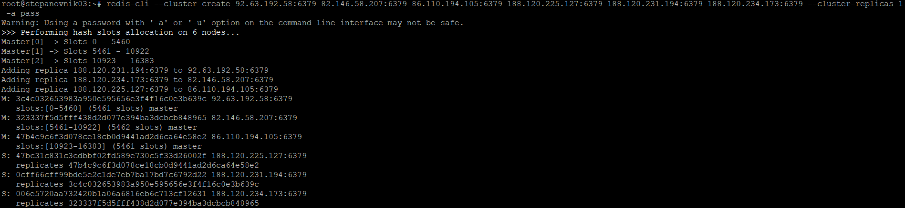

Еще раз взглянем на конфиг:

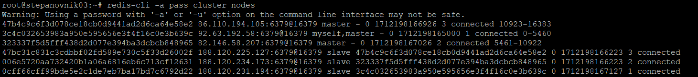

И протестируем с помощью redis-benchmark:

Запросы по 3 байта

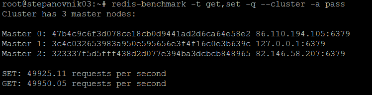

Получили 150 КБ/с.

Запросы по 1МБ:

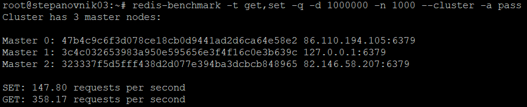

Около 200 МБ/с

Скорость, конечно, упала, но результаты все еще очень хорошие.

Теперь загрузим и считаем данные из json файла в виде строки с помощью python.

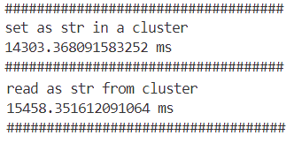

Скорость упала до 4 МБ/с. Но это, наверное, все еще хорошо, потому что скорость интернета MIPT-Telecom почти такая же.

Потому что redis-bench запускалась с одной из нод, а файл загружался из стороннего клиента (моего компа).

Теперь отключим один из мастеров и убедимся, что кластер доступен:

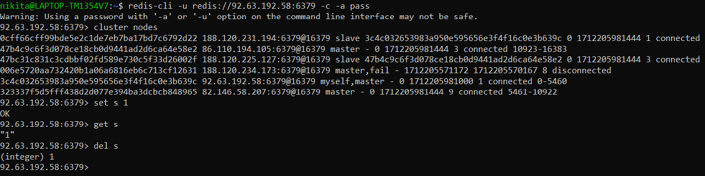

Отключаем его реплику:

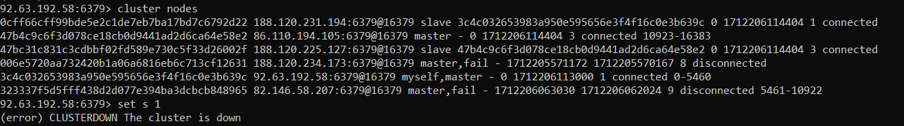

Результат соответсвует ожиданиям.

### Вывод
Поработали с Redis. Как и все нормальные современные СУБД он довольно прост в использовании. Удобный интерфейс, документация и т.д. Например, если поднимать кластер после выключения, то все само подтягивается и встраивается в работу.

Только под конец я осознал смысл задания "поднять на 3х нодах". Можно было на каждом сервере поднимать 2 редиса: мастер и реплика мастера из другого сервера. Но алгоритм действий был бы абсолютно такой же.
