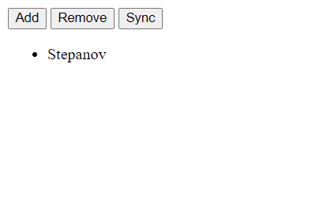
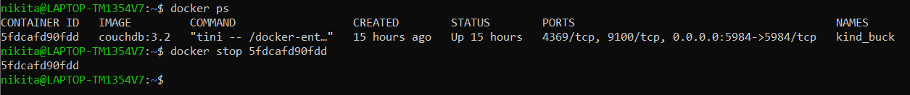

## Отчет

1. С помощью команды `docker run -p 5984:5984 -e COUCHDB_USER=admin -e COUCHDB_PASSWORD=password -d couchdb:3.2` запустим CouchDB в докере. (версия latest никак не хотела скачиваться)

2. Затем перейдем по адресу `http://localhost:5984/_utils`. Попадаем в веб интерфейс БД, авторизуемся.

3. Создаем БД с оригинальнейшим названием:

4. Добавим документ в БД и подправим в html файле путь до БД. Также пришлось включить CORS в настройках CouchDB и скачать файл с PouchDB `pouchdb-8.0.1.min.js`:

5. Откроем html файл в браузере и нажмем sync:

6. Теперь выключим контейнер:

7. Убеждаемся, что при перезапуске html страницы и нажатии sync появляется фамилия. Сохраняем страницу из chrome, файл находится в папке `saved_from_chrome`.

## Вывод
Поработали CouchDB/PouchDB, увидели синхронизацию локальной БД поднятой из javascript с удаленной, и их независимую работу.