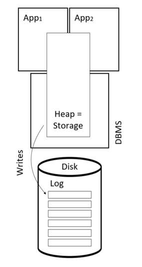

# Отчет об использовании *** СУБД

## История
Создание СУБД началось в 2006 году швейцарской компанией Starcounter AB. В 2015 в неё инвестировали 1,8 млн\$. В 2017 компания получила ещё 35 миллионов крон (~3,5 млн\$), а потом в том же году выиграла приз в размере 2,2 млн евро в каком-то конкурсе.

## Взаимодействие
Starcounter предоставляет три инструмента для взаимодействия:
 - C#: основной сценарий использования данной СУБД - в качестве библиотеки для C#. Т.е. используем Starcounter когда пишем свое приложение на C#
 - star CLI: инструмент командной строки для управления базой данных
 - REST API: в библиотеке есть встроенный HTTP сервер, можно самому реализовать логику работы с БД или сразу писать приложение

## Engine
Это in-memory база данных, то есть данные хранятся в оперативной памяти со всеми вытекающими последствиями в виде логов, которые пишутся на диск для восстановления данных после сбоя. Используется какой-то крутой движок, говорят что очень быстрый.



## Язык запросов
Starcounter создан для использования из C#, соответственно и запросы пишутся на этом языке с поддержкой SQL синтаксиса.

## Язык на котором написана СУБД
При написании использовались языки C# и C++.

## Индексы
Starcounter поддерживает индексы практически на любом типе поля.

Варианты создания индекса:
 - Командой:
 ```
var ddlExecutor = services.GetRequiredService<IDdlExecutor>();

ddlExecutor.Execute("CREATE INDEX IX_Person_FirstName ON Person (FirstName)");
 ```

 - Или при объявлении таблицы:
```
using System;
using Starcounter.Database;

[Database]
public abstract class Person
{
    [Index]
    public abstract string Name { get; set; }
}
```

## План запроса
Конечно же SQL оптимизатор строит какой-то план, но как его посмотреть я не нашел.

Единственный способ взаиможействия с ним - это подсказки , которые мы можем добавить к запросу, используя команду `OPTION`.

```
SELECT e.FirstName, e.LastName FROM Employee e 
WHERE e.FirstName = 'John' AND e.LastName = 'Smith' 
OPTION INDEX (e MyIndexOnLastName)
```

В этом примере мы указали предпочтительный индекс для поиска.

## Транзакции
Starcounter поддерживает ACID транзакции, тут все хорошо. Более того, в последней версии (3.0.0) DML операции можно выполнять только внутри транзакций.

Пример использования транзакции:
```
var transactor = services.GetRequiredService<ITransactor>();

transactor.Transact(db =>
{
    var person = db.Insert<Person>(); // Adds a row to the Person table.
    person.Name = "Gandalf";
});
```

## Восстановление
Как и в любой другой in-memory СУБД для восстановления используется журнал транзакций.

## Шардирование
Шардирование СУБД не поддерживает, это противоречит её философии. Взамен сложному, но масштабируемому приложению Starcounter даёт простое и очень быстрое, компенсируя отсутствие масштабирования и упрощая разработку и поддержку.

## OLAP
К данной СУБД OLAP и Data Warehousing точно не относится. 

## Защита
Доступ к БД имеют только локальные приложения, поэтому защиты нет. Если использовать встроенный сервер, то для шифрования нужно сконфигурировать NGINX, который будет обрабатывать HTTPS трафик и перенаправлять его на сервер Starcounter. Авторизация тоже будет на уровне обработки HTTP трафика.

## Сообщество
Starcounter это закрытая коммерческая СУБД, развивает её компания Starcounter AB. На официальном GitHub можно открыть issue. И еще там есть репозиторий с open-source расширениями.

## Ресурсы
Официальный сайт: https://starcounter.com и https://starcounter.io

Документация: https://docs.starcounter.io

GitHub: https://github.com/Starcounter